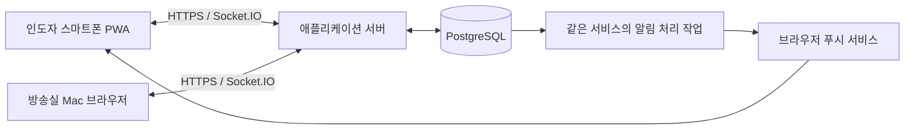

# 기술 구조·데이터·신뢰성·로그인 기획안

작성일: 2026-09-16 · 2차 검토: 2026-09-17. 이 문서는 구현 전 제안이며, 라이브러리·호스팅·정책값을 확정한 명세가 아닙니다.
사용자가 요청한 버튼 중심의 소통, 보조 텍스트 입력, 간단한 로그인, 개인 스마트폰과 방송실 Mac 브라우저 사용을 기준으로 작성했습니다.
버튼 편집 화면·색상·분류·배치 등 설정의 세부 기획은 이번 범위에서 미룹니다.

## 1. 권장 구성과 선택 이유

첫 버전은 **반응형 웹/PWA + 하나의 애플리케이션 서버 + PostgreSQL** 구성을 제안합니다.
화면을 열었을 때의 실시간 갱신은 Socket.IO, 잠긴 휴대폰으로 보내는 알림은 Web Push가 담당합니다.
요청의 접수·변경은 HTTPS API로 수행하고, Socket.IO는 저장된 변경을 화면에 알려주는 경로로 사용합니다.
따라서 실시간 연결이 재설정되어도 저장된 요청과 처리 이력은 데이터베이스에서 다시 가져올 수 있습니다.

mediasoup은 미디어 전달과 DataChannel을 지원하지만, 인증·채팅 등에 활용할 별도의 통신 경로도 애플리케이션이 구성해야 합니다.
음성·영상이 필요하지 않은 현재 요구에서는 그 추가 구성을 도입할 이유가 작다는 판단입니다. [mediasoup 통신 문서](https://mediasoup.org/documentation/v3/communication-between-client-and-server/)

Socket.IO는 양방향 이벤트 통신과 여러 전송 방식을 제공하는 라이브러리이며, 일반 WebSocket과 동일한 프로토콜은 아닙니다.
클라이언트와 서버에 서로 호환되는 Socket.IO를 사용해야 합니다. [Socket.IO 소개](https://socket.io/docs/v4/)

위 그림에서 알림 처리 작업은 처음부터 별도 서버일 필요가 없습니다. 서버 안의 반복 작업으로 시작할 수 있습니다.
단일 서버가 중단되면 실시간 소통도 중단된다는 한계는 남습니다. 자동 재시작·복구와 현장 대체 연락 절차가 필요합니다.

| 구성 요소 | 초기 제안 | 선택 이유 |
|---|---|---|
| 화면 | TypeScript 기반 반응형 웹/PWA | 인도자와 방송실 화면을 한 서비스에서 제공 |
| 애플리케이션 | Node.js + Socket.IO | API·실시간 통지·알림 처리를 한 언어로 관리 |
| 저장소 | PostgreSQL | 요청·상태 변경·중복 방지를 함께 저장 |
| 인증 | 서버에 저장하는 세션 + 쿠키 | 로그아웃과 계정 비활성화 시 접속 회수 용이 |
| 배포 | 상시 실행되는 서버 + 관리형 DB 우선 검토 | 장시간 연결과 DB 운영 업무를 분리 |

프런트엔드 프레임워크와 인증 라이브러리는 개발자의 익숙함·유지보수 상태를 확인한 뒤 선택합니다.
Redis·별도 메시지 브로커·마이크로서비스는 현재 제안에 포함하지 않습니다.
대안은 HTTPS + SSE 또는 관리형 실시간 서비스입니다. 전자는 단방향 통지 구조, 후자는 운영 부담과 공급자 의존성을 비교할 때 검토합니다.
네이티브 앱은 PWA 실기기 검증에서 설치·알림 사용성이 요구에 맞지 않을 때 재검토합니다. 배경 수신을 위해 Socket.IO 연결을 계속 유지하는 방안은 채택하지 않습니다. [Socket.IO 모바일 제약](https://socket.io/docs/v4/#what-socketio-is-not)

## 2. 로그인과 예배 참여

아이디·비밀번호로 로그인하고 개인 스마트폰에서는 로그인 유지 선택을 제공하는 안을 제안합니다.
초기 계정은 관리자가 발급하고 첫 접속에서 사용자가 비밀번호를 설정하도록 하는 방식이 운영하기 쉽습니다.
회원가입 방식·로그인 유지 기간·비밀번호 재설정 절차는 사용자의 확인이 필요한 정책입니다.

사용자 계정과 예배별 역할을 나눕니다. 첫 버전은 한 사용자에게 한 회차의 운영 역할 하나를 부여하는 안을 제안하며, 관리자 권한은 별개입니다.
관리자 권한은 계정·예배 관리를 위한 권한으로 분리하고, 관리자라는 이유만으로 모든 대화 내용을 열람하도록 만들지는 않습니다.
화면의 역할 선택만으로 권한이 생기지 않으며, 서버가 허용한 예배와 역할만 사용할 수 있습니다.

처음 참여하는 회차는 진행 중 예배가 하나여도 날짜·회차를 확인한 뒤 입장합니다. 여러 예배가 있으면 이름과 시간을 보고 선택합니다.
이미 참여한 회차에 재방문하고 해당 회차가 진행 중이며 접근 권한도 유효한 경우에만 바로 복귀합니다.
예배는 날짜별 진행 단위로 구분하여 지난주 미처리 요청이 이번 주 새 요청으로 나타나지 않게 합니다.
예배 이름·입장 방식·생성 담당자는 제품 기획에서 정할 사항이며, 초대 주소를 아는 것만으로 대화를 열람하게 하지는 않습니다.
회차는 `준비 → 진행 → 종료`로 구분합니다. 준비 중에는 참여·조회하고, 실제 예배 전 음향 조정부터 필요하면 진행으로 열어 요청·응답을 받습니다. 연습은 별도 회차입니다.
종료 후에는 허용된 이력 조회만 가능하고 새 요청·답변·피드백·상태 변경을 막습니다. 재개는 첫 버전에서 보류하며, 종료 후 발견한 실제 조정 사실은 별도의 현장 운영 기록으로 남깁니다.

## 3. 데이터 모델 초안

| 데이터 | 주요 내용 | 필요한 이유 |
|---|---|---|
| User | 내부 ID, 로그인 ID, 표시 이름, 비밀번호 해시, 활성 여부 | 송신자 식별과 접속 회수 |
| AuthSession | 사용자, 만료·폐기 시각, 기기 구분 | 로그인 유지와 기기별 로그아웃 |
| WorshipSession | 예배 ID, 이름, 연습 구분, 진행·보관 상태, 시작·종료 시각 | 예배별 요청 분리와 보관 종료 판단 |
| Membership | 사용자, 예배, 운영 역할, 접근 상태, 권한 버전, 책임 권한 | 조회·송신·처리·담당 재배정 검사 |
| PersonalButton | 소유 사용자, 버튼 ID, 짧은 이름, 전송 문구, 사용 여부, 버전 | 개인별 생성·수정·보존의 최소 모델 |
| Request | 요청 ID, 예배, 요청/안내 종류, 송신자·대상, 문구, 담당자, 상태·버전, 원 요청 ID | 현재 상태와 추가 요청 연결 |
| Reply | 답변 ID, 원 요청, 작성자, 본문, 서버 시각 | 원 요청 상태를 덮어쓰지 않는 답변 |
| RequestEvent | 이벤트 ID, 요청, 수행자, 변경 내용, 서버 시각 | 상태 변화와 담당자 이력 |
| Operation | 사용자·회차·작업 ID, 동작·입력 요약값, 적용/폐기 결과 | 생성·답변·상태 변경의 중복 실행 방지 |
| DeliveryReceipt (선택) | 이벤트, 수신 사용자·기기, 앱 수신 시각 | 기기 도착 여부를 진단할 때만 사용 |
| PushSubscription | 사용자·기기, 구독 정보, 활성 여부 | 잠금 상태 알림 전송 |
| Outbox | 이벤트·대상·채널, 시도 횟수, 다음 시도, 처리 결과 | DB 저장 이후 통지 실패 복구 |

요청에는 버튼 ID만 저장하지 않고 **전송 당시 문구를 함께 저장**합니다. 나중에 버튼 문구를 고쳐도 과거 요청은 바뀌지 않습니다.
개인 버튼은 회차와 독립적으로 보존하고 본인만 생성·수정합니다. 버튼 편집과 전송은 별개이며, 편집 충돌은 버전으로 검사합니다. 순서·색상·공유·편집 화면은 후속 기획에서 정합니다.
수신 대상은 해당 예배의 방송실 팀 또는 특정 참여자로 구분합니다. 팀 요청은 그 예배의 권한 있는 방송실 담당자가 함께 봅니다.
서버가 인증 정보에서 송신자를 결정하고, 클라이언트가 임의의 송신자 ID나 담당자 이름을 지정하게 하지 않습니다.
직접 입력한 메시지도 요청과 같은 전송·접근 통제를 사용하되, 답변은 원 요청에 연결하여 대화 맥락을 보존합니다.

## 4. 전달 상태와 사람의 처리 상태

**전송 성공과 담당자의 확인을 서로 다른 정보로 저장합니다.**

| 구분 | 상태 예시 | 실제 의미 |
|---|---|---|
| 송신 기기 | 전송 중 | 접수를 시도하고 있지만 결과 미확정 |
| 서버 | 서버 접수 | 데이터베이스에 요청 저장 완료 |
| 수신 기기 | 앱 수신 | 수신 화면 코드가 해당 이벤트를 수신 |
| 담당자 | 확인했어요 | 담당자가 명시적으로 확인 버튼을 누름 |
| 담당자 | 조정했어요 | 담당자가 조치를 마쳤다고 응답 |
| 인도자 | 이제 괜찮아요 | 조정 결과에 대한 요청자의 피드백 |

앱 수신은 사람이 읽었다는 뜻이 아닙니다. 초기 사용자 화면에는 서버 접수·담당자 확인·조정 완료를 중심으로 표시합니다. 앱 수신 기록은 진단용 선택 항목이며 첫 버전의 필수 사용자 상태로 추가하지 않습니다.
처리 상태의 기본 전이는 `접수 → 확인 → 조정 완료`입니다. 첫 버전에서는 담당자가 명시적으로 확인하여 담당 배정이 끝난 뒤 조정 완료를 누르도록 합니다.
`이제 괜찮아요`는 별도 피드백으로 기록하며, 피드백이 없다는 이유만으로 방송실의 조정 완료를 되돌리지 않습니다.
추가 조정이 필요하면 원 요청에 연결된 새 요청을 만드는 안을 제안합니다. 완료된 요청이 조용히 다시 미처리 상태가 되는 혼란을 줄입니다.
종류가 행동 요청이면 확인 후 완료·처리 불가로 진행합니다. 종류가 단순 안내이면 지정 수신자의 명시적 확인으로 `확인 완료(안내)`가 되며 처리 중·조정 완료를 거치지 않습니다. 전송 후 종류를 바꾸지 않습니다.
취소·처리 불가·예배 종료 시 미처리 건은 별도 종료 사유로 남깁니다. 처리하지 않은 요청을 자동으로 완료 처리하지 않습니다.
‘처리할 수 없어요’는 사유를 포함한 처리 불가 종료이며, 단순 지연 안내는 답변을 남기고 처리 중 상태를 유지합니다.
취소와 완료는 같은 요청 버전에서 먼저 저장된 변경이 적용됩니다. 취소가 먼저 저장됐지만 실제 조정을 이미 했다면 취소 상태를 유지하고 사실을 답변으로 남깁니다. 앱의 취소는 물리 조정을 되돌리지 않습니다.

## 5. 저장부터 복구까지의 흐름

Socket.IO의 기본 전달 보장은 메시지 유실을 모두 복구하는 방식이 아니므로, 데이터베이스 저장·식별자·재동기화를 애플리케이션에서 설계합니다. [Socket.IO 전달 보장](https://socket.io/docs/v4/delivery-guarantees/)

1. 버튼을 누르면 기기에서 작업 ID를 생성하고, 동일 시도의 ID를 재사용할 수 있게 보관합니다.
2. 서버는 현재 세션·화면의 계정/회차/역할 문맥과 열람 권한을 확인합니다. 같은 사용자·회차·작업 ID의 확정 결과가 있으면 동작·입력 일치를 검사한 뒤 새 동작 없이 반환하며, 회차 종료 후에도 조회 권한은 검사합니다.
3. 새 작업이면 한 DB 트랜잭션에서 계정·참여 권한과 회차 진행 상태를 다시 검사하고, 요청 상태·버전·수신 대상·문구를 검증합니다.
4. 요청·이벤트·작업 결과·Outbox를 함께 저장합니다. 답변·확인·취소·담당 인계도 같은 작업 ID 원칙을 적용합니다.
5. 저장 확정 후에만 요청 ID와 저장 시각을 포함한 접수 응답, 즉 ACK를 반환합니다.
6. 알림 작업이 Outbox를 읽어 권한 있는 수신자에게 실시간 통지와 필요한 푸시를 시도합니다.
7. 담당자의 버튼 응답을 기록합니다. 진단용 앱 수신 기록을 도입한다면 사람의 확인 기록과 별도로 저장합니다.

요청 접수·상태 변경·회차 종료는 같은 회차 행을 잠그고 진행 상태 검사부터 저장까지 순서를 정합니다. 종료가 먼저 확정되면 이후 명령은 거절하고, 접수가 먼저 확정되면 종료 작업이 그 요청도 마감합니다. 계정·참여 권한 변경과 명령 저장도 공통 행 잠금 순서를 사용하여 권한 검사 직후 회수가 발생하는 경합을 막습니다. [PostgreSQL 행 잠금](https://www.postgresql.org/docs/current/explicit-locking.html#LOCKING-ROWS)
작업 ID는 사용자·회차 범위에서 유일하게 저장합니다. 같은 ID에 동작·본문·대상이 달라지면 거절하고, 명시적인 새 요청은 새 ID를 사용합니다. 이는 문구만 비교하는 중복 방지와 다릅니다. [PostgreSQL 유일성 제약](https://www.postgresql.org/docs/current/ddl-constraints.html#DDL-CONSTRAINTS-UNIQUE-CONSTRAINTS)
접수 응답이 끊겼다면 화면에 `접수 여부 확인 중`을 표시하고 같은 작업 ID로 결과를 조회합니다.
서버에 이미 저장되어 있으면 기존 요청으로 복구합니다. 응답 시간 초과를 곧바로 ‘전송 실패’로 표시하거나 새 ID를 발급하지 않습니다.
조회에서 없다고 나왔어도 원본이 뒤늦게 도착할 수 있으므로 실패 확정으로 표시하지 않습니다. 필요성이 유지되어 사용자가 다시 보낼 때는 같은 작업 ID와 같은 내용을 사용합니다.

오프라인에서 새로 누른 요청은 전송된 것으로 표시하지 않습니다. 기기에 미전송 상태로 남기고, 연결 복구 후 사용자가 지금도 필요한지 확인해 보내도록 제안합니다.
첫 버전은 명령의 자동 재시도·백그라운드 일괄 전송을 하지 않는 안으로 단순화합니다. 별도의 만료 전송 토큰은 도입하지 않으며, 결과 불명 상태를 접수 또는 폐기 확정하기 전 새 ID로 바꾸지 않습니다.
버리기를 선택한 미확정 작업은 서버에 **작업 폐기 확정**을 요청합니다. 같은 ID의 폐기 기록이 원본보다 먼저 저장되면 늦은 원본은 실행하지 않습니다. 원본이 먼저 적용됐다면 기존 결과를 반환하고, 필요하면 요청 취소라는 별도 동작으로 이어집니다.
폐기 응답도 끊길 수 있으므로 같은 ID로 결과를 확인합니다. 오프라인에서는 `폐기 확인 중`이며 기기 항목 삭제나 취소 완료로 대신하지 않습니다. 한 번도 송신하지 않은 로컬 초안만 즉시 버릴 수 있습니다.
이미 접수한 동작의 폐기는 실행 취소를 뜻하지 않습니다. 확인·완료처럼 적용된 응답도 기존 결과를 복구하며, 반대 동작을 자동 실행하지 않습니다.
이 설계도 원 전송 패킷 자체의 지연까지 제거하지는 못합니다. 요청에는 사용자 동작 시각(참고값)과 서버 접수 시각을 구분하고, 오래된 내용은 담당자가 현재 필요한지 확인합니다. 기기 시각을 서버 상태 결정의 기준으로 삼지 않습니다.

DB 저장 직후 서버가 멈추어 통지를 못 해도 Outbox가 남으므로 재시작 후 다시 시도할 수 있습니다.
Outbox는 대상·채널별 결과를 남기며 매 발송 직전에 계정·현재 회차 권한·구독 소유자·알림 유효성을 다시 검사합니다. 회수와 발송 시작은 단일 서버에서 사용자별 순서를 맞추고, 이미 외부 전송을 시작한 작업은 회수 보장 범위에서 제외합니다. DB 잠금을 외부 푸시 응답 동안 유지하지 않습니다.
통지는 중복될 수 있으며, 화면에서는 이벤트 ID와 요청 버전으로 이미 반영한 이벤트를 다시 적용하지 않습니다.
푸시 서비스의 접수 응답은 사용자에게 알림이 보였거나 읽혔다는 증거가 아닙니다. 푸시로 요청의 처리 상태를 변경하지 않습니다.

처음에는 재접속·화면 복귀 때 해당 예배에서 볼 수 있는 요청의 최신 상태를 다시 조회하는 방식으로 시작할 수 있습니다.
실시간 구독 후 최신 상태를 조회하며 동일 화면 문맥의 이벤트만 합칩니다. 요청 상태는 버전으로, 답변·이력은 고유 ID로 병합합니다. 권한·역할 변경 때는 전체 접근 목록을 교체하여 더 이상 허용되지 않은 항목을 캐시에 남겨 다시 표시하지 않습니다.
Socket.IO의 연결 복구 기능은 보조 수단으로 사용할 수 있지만 항상 성공하지는 않습니다. 복구 성공 여부와 무관하게 권한은 다시 확인합니다. [연결 복구 제약](https://socket.io/docs/v4/connection-state-recovery/)

## 6. API와 이벤트 계약 초안

| 경로 또는 이벤트 | 목적 | 핵심 계약 |
|---|---|---|
| `POST /auth/login` | 로그인 | 쿠키 발급, 활성 계정 검사 |
| `POST /auth/logout` | 로그아웃 | 서버 세션 폐기, 해당 연결 해제 |
| `GET /me/worship-sessions` | 참여 가능한 예배 조회 | 서버 권한 기준 결과 |
| `GET/POST/PATCH /me/buttons[/:id]` | 개인 버튼 조회·생성·수정 | 소유자·문구 검사, 수정은 예상 버전 |
| `GET /worship-sessions/:id/requests` | 현재 요청 복구 | 접근 가능한 요청·현재 버전·답변·이력 반환 |
| `POST /worship-sessions/:id/requests` | 버튼/직접 입력 전송 | 작업 ID, 종류, 대상, 문구, 화면 문맥 검사 |
| `GET /worship-sessions/:id/operations/:operationId` | 적용·폐기 결과 조회 | 본인 작업 및 현재 접근 권한 검사 |
| `POST /worship-sessions/:id/operations/:operationId/retire` | 미확정 작업 폐기 확정 | 먼저 저장된 적용/폐기 결과 반환 |
| `POST /requests/:id/actions` | 확인·조정·취소·피드백·인계 | 작업 ID, 동작, 예상 버전, 동작별 권한 |
| `POST /requests/:id/replies` | 원 요청에 답변 | 작업 ID, 본문, 회차 진행·참여 검사 |
| `POST /push-subscriptions` | 기기 알림 등록 | 현재 사용자에게만 연결 |
| `session:subscribe` | 실시간 구독 | 예배 참여와 현재 역할 검사 |
| `request:changed` / `reply:added` | 저장된 상태 변경·답변 통지 | 이벤트 ID, 요청 ID, 상태 버전 또는 답변 ID |
| `event:received` (선택) | 진단용 앱 수신 기록 | 이벤트 ID, 서버가 검증한 기기 정보 |

요청 관련 변경 응답은 성공 여부·작업 ID·요청 ID·현재 버전·서버 시각을 통일된 구조로 반환합니다.
오류는 미인증·권한 없음·화면 문맥 변경·예배 종료·작업 폐기·보관 종료·버전 충돌·입력 오류·일시 장애를 구분합니다.
ACK 제한시간이 지났다는 이유만으로 서버 처리 취소를 추정하지 않습니다. 서버의 작업 조회가 최종 판정 기준입니다.
본문 길이·요청 빈도 제한값은 실사용을 보고 정하며, 거절된 요청을 성공처럼 표시하지 않습니다.
답변은 요청 상태를 덮어쓰지 않는 추가 기록이므로 예상 처리 버전 때문에 서로의 답변을 누락시키지 않습니다. 각 답변은 자체 ID와 작업 ID로 중복을 막고, 처리 버튼은 예상 버전을 검사합니다. 완료·취소된 요청에도 진행 회차에서는 사실 설명을 답변할 수 있습니다.

## 7. 여러 방송실 담당자의 동시 처리

첫 확인을 요청 담당자가 되는 동작으로 묶는 안을 제안합니다. 다른 담당자는 누가 처리 중인지 볼 수 있습니다.
두 사람이 같은 버전의 요청을 확인하면 DB의 조건부 갱신으로 한 사람만 담당자가 되고, 다른 사람에게 현재 담당자를 반환합니다.
이후 상태 변경도 현재 버전을 조건으로 저장하여 늦게 도착한 응답이 완료 상태를 덮어쓰지 못하게 합니다.
한 사람이 확인하고 다른 사람이 조정할 경우에는 담당 인계 동작을 명시적으로 거치고 이력에 남깁니다.
초기에는 자동 담당 해제 시간을 두기보다 명시적인 인계를 권합니다. 잠깐 연결이 끊겼다는 이유로 실제 조치가 중복 실행되는 것을 줄입니다.
기존 담당자가 부재하거나 권한을 잃으면 `인계 필요`를 표시합니다. 해당 회차의 방송실 책임 권한자가 실제 조정 상황을 확인하고 사유·새 담당자를 남겨 재배정할 수 있어야 합니다. 계정 관리자에게 이 권한을 자동 부여하지 않습니다.
재배정 후 이전 담당자의 늦은 완료 명령은 담당자·버전 검사로 거절합니다. 역할 변경도 맡은 미처리 요청의 인계를 해결한 뒤 적용하며, 권한 회수는 인계를 기다리지 않고 즉시 차단합니다.
이 서비스는 요청과 응답을 기록합니다. 음향 장비·냉방 장비를 자동 제어하는 기능은 현재 범위에 포함하지 않습니다.

## 8. 모바일 푸시와 PWA 제약

아이폰에서는 iOS 16.4부터 홈 화면 웹 앱의 Web Push를 지원하며, 사용자 동작을 통한 알림 허용이 필요합니다.
집중 모드는 알림 전달 경험에 영향을 줍니다. 설치·권한·집중 모드를 실제 사용할 휴대폰에서 확인해야 합니다. [Apple WebKit 안내](https://webkit.org/blog/13878/web-push-for-web-apps-on-ios-and-ipados/)
알림 허용을 거부해도 화면을 열어 요청을 보내고 최신 상태를 확인할 수 있게 합니다. 권한 거부를 로그인 실패로 다루지 않습니다.
전경 실시간 수신과 푸시의 중복은 서버에서 발송 대상·시점을 정할 때 줄입니다. 연결 중이라는 사실만으로 사람이 보고 있다고 간주하지 않습니다.
WebKit은 푸시를 받으면 사용자에게 보이는 알림을 표시하도록 요구합니다. 전경이라는 이유로 받은 푸시를 숨기는 설계를 피합니다. [WebKit의 표시 요구](https://webkit.org/blog/12945/meet-web-push/)
알림에는 기본적으로 ‘새 메시지가 있습니다’처럼 새 요청·응답 모두에 맞는 최소 내용을 넣습니다. 누르면 현재 인증 상태와 접근 권한을 다시 확인하고, 필요하면 재인증한 뒤 실제 요청의 최신 상태를 조회합니다.
이미 취소·완료되었거나 예배가 종료된 요청에 대한 과거의 미확인 요청 알림은 서버에서 보내기 전에 제외합니다. 최신 조정 완료 응답을 인도자에게 알리는 푸시는 별개의 알림이므로 요청이 완료되었다는 이유만으로 막지 않습니다.
각 알림에는 용도에 맞는 유효기간을 둡니다. 이미 푸시 서비스에 넘긴 알림을 회수하거나 기기에 표시된 내용을 삭제할 수 있다고 보장하지 않으므로 기본 본문을 최소화합니다.
로그아웃·계정 교체 시 해당 기기의 서버 구독 연결을 해제하고, 재로그인한 사용자와 이전 사용자의 알림을 섞지 않습니다.

## 9. 로그인·권한·개인정보 보호

비밀번호는 검증된 라이브러리로 Argon2id 등 적합한 비밀번호 해시를 사용하여 저장하고 원문이나 복호화 가능한 값으로 보관하지 않습니다. [OWASP 비밀번호 저장](https://cheatsheetseries.owasp.org/cheatsheets/Password_Storage_Cheat_Sheet.html)
로그인 실패 메시지는 계정 존재 여부를 드러내지 않게 통일하고, 계정·접속 위치 기준의 시도 제한과 관리자의 복구 절차를 둡니다. [OWASP 인증](https://cheatsheetseries.owasp.org/cheatsheets/Authentication_Cheat_Sheet.html)
세션은 HTTPS 쿠키로 전달하고 `Secure`, `HttpOnly`, 명시적인 `SameSite` 속성을 적용합니다. 세션 만료는 서버가 집행합니다. [OWASP 세션 관리](https://cheatsheetseries.owasp.org/cheatsheets/Session_Management_Cheat_Sheet.html)
로그인·권한 변경 시 세션을 갱신하고, 비밀번호 재설정·계정 비활성화 시 기존 세션을 폐기합니다.
공용 방송실 Mac의 로그인 유지 기본값은 개인 스마트폰과 다르게 두는 안을 제안합니다. 실제 만료 기간은 예배 길이와 운영 절차에 맞춰 정합니다.
화면에는 조회 당시 계정·회차·역할·세션 세대의 문맥을 묶고 모든 변경 시 서버의 현재 문맥과 비교합니다. 다른 탭에서 B 계정으로 로그인한 뒤 A 화면에서 누른 요청은 B 이름으로 실행하지 않고 갱신을 요구합니다. 클라이언트의 계정 값은 권한 부여 근거가 아니라 불일치 검사용입니다.
화면·API·Socket.IO 모두에서 요청마다 예배 참여·역할·요청 소유 관계를 검사합니다. ID를 추측하거나 바꿔 다른 인도자의 요청을 읽을 수 없어야 합니다. [OWASP 권한 검사](https://cheatsheetseries.owasp.org/cheatsheets/Authorization_Cheat_Sheet.html)
WebSocket 연결 시 허용 Origin과 세션을 검사하고, 이미 연결된 사용자도 세션 만료·권한 회수 시 연결과 구독을 해제합니다. [OWASP WebSocket 보안](https://cheatsheetseries.owasp.org/cheatsheets/WebSocket_Security_Cheat_Sheet.html)
HTTP 변경 요청에는 CSRF 방어를 적용하며, 웹소켓의 Origin 검사를 CORS 설정만으로 대신하지 않습니다.
계정 비활성화·예배 탈퇴 후에는 서버 접근과 실시간·푸시의 새 발송을 차단합니다. 연결 복구 기능이 예전 권한을 되살리지 않게 합니다. 이미 외부 푸시 서비스에 전달했거나 기기에 표시된 알림의 회수는 보장하지 않습니다.
입력 문구는 실행 가능한 HTML로 렌더링하지 않고, 길이와 형식을 검증합니다. 오류 로그에는 비밀번호·세션 값·푸시 구독 비밀값을 남기지 않습니다.
수집 정보는 이름·로그인 식별자·역할·요청 기록 등 운영에 필요한 항목으로 제한하고, 전화번호·생년월일을 기본 필수 항목으로 추가하지 않습니다.
대화 본문을 기술 로그에 반복 저장하지 않으며, 관리자 감사 기록은 계정 변경·권한 변경·요청 처리 같은 필요한 행위 중심으로 남깁니다.
요청 기록·작업 중복 방지 기록·백업의 보관 기간은 운영 담당자와 별도 결정합니다. 탈퇴 후 이름 제거와 기록 삭제 범위도 함께 정합니다.
인증·개인 데이터 응답은 `Cache-Control: no-store`를 적용하고 개인 메시지를 PWA 정적 캐시에 저장하지 않습니다. 필요한 로컬 초안·미확정 작업은 계정·회차별로 분리하며, 공유 Mac에서는 다음 계정에 승계하지 않습니다. [OWASP 캐시와 로그아웃](https://cheatsheetseries.owasp.org/cheatsheets/Session_Management_Cheat_Sheet.html#web-content-caching-and-clear-site-data)
로그아웃·계정 교체는 화면 잠금→기존 세션·구독 폐기→메모리·본문·초안 정리→새 로그인 순서로 처리합니다. 오프라인 로그아웃은 로컬 잠금과 서버 세션 폐기가 아직 다름을 표시하고, 같은 브라우저 계정 교체는 서버 폐기를 확인한 후 진행합니다.
미확정 작업은 예외적으로 IndexedDB의 계정별 복구 영역에 회차 ID·작업 ID만 남기고 본문·전송 페이로드는 제거합니다. 동일 계정 재인증 후 결과 조회에만 쓰고 다른 계정에 표시·재전송하지 않습니다. 해결 또는 회차 종료 확인 후 정리하며, 기기 저장소가 지워졌다면 서버 이력·현장 확인으로 판단하고 자동 재전송하지 않습니다. [MDN IndexedDB](https://developer.mozilla.org/en-US/docs/Web/API/IndexedDB_API)
열린 탭에도 계정 변경을 알려 초기화하고, 늦은 HTTP 응답·소켓 이벤트·뒤로가기 복원 화면은 현재 문맥과 다르면 버립니다. 탭 통지는 편의 기능이며 최종 방어는 서버 검사입니다. [MDN 탭 간 통신](https://developer.mozilla.org/en-US/docs/Web/API/Broadcast_Channel_API)

### 기록 수명과 재시도 경계

회차가 진행 중이면 해당 회차의 작업 적용·폐기 기록을 먼저 삭제하지 않습니다. 종료 후에도 정한 조회 기간 동안 결과를 보존하며, 요청·답변 삭제와 중복 방지 기록 정리 순서를 함께 정합니다.
보관이 끝난 작업은 ‘한 번도 접수되지 않음’ 대신 `보관 종료`로 응답하고 재실행하지 않습니다. 종료 회차를 다시 열지 않고 회차 ID도 재사용하지 않아, 기록 삭제 뒤의 오래된 명령이 신규 접수되지 않게 합니다.
보관 종료 판정에 필요한 회차 상태 등 최소 식별정보는 정한 기간만 유지합니다. 그 정보까지 삭제됐거나 허용되지 않은 회차 ID이면 조회 불가로 응답하고 새 회차로 자동 생성하지 않습니다. 알 수 없는 ID를 미접수 확정이나 재실행 허가로 해석하지 않습니다.
개인 버튼은 회차 종료와 별개로 유지합니다. 요청 본문 삭제 시 답변·Outbox의 본문 복제도 함께 정리하며, 보관 기간과 백업 만료값은 실제 도입 전에 정합니다.

## 10. 배포와 운영 검증

클라우드의 상시 실행 서버를 우선 제안합니다. 스마트폰이 교회 Wi-Fi 또는 이동통신 어느 쪽을 쓰더라도 같은 주소로 접속하는 구성이기 때문입니다.
교회 내부 서버는 현장 인터넷 단절 대응 대안이지만, 외부 접속·HTTPS·푸시 연결·전원·백업 관리가 추가됩니다. 필요가 확인되면 별도 비교합니다.
호스팅 선택 전 WebSocket 유지, 프로세스 자동 재시작, HTTPS 갱신, DB 백업과 복구 경로를 확인합니다. 무료 요금제의 절전 여부도 계약 시점에 확인할 항목입니다.
DB 백업은 생성 여부와 실제 복구 가능 여부를 따로 검증합니다. PostgreSQL은 여러 백업 방식을 제공하므로 운영 환경에 맞춰 선택합니다. [PostgreSQL 백업·복구](https://www.postgresql.org/docs/current/backup.html)
정상 재시작은 같은 DB의 미전송 통지를 재검사해 복구하지만, 과거 백업 복원은 접수·폐기 기록도 되돌아가므로 접수·자동 통지를 잠그고 세션·푸시 연결을 무효화합니다. 삭제·권한 회수 기록을 재적용하고 자료가 부족하면 권한을 다시 확인합니다. 복원된 진행 회차는 현장 대조 후 복구 사유로 마감하며, 계속 사용할 때는 새 회차 ID로 명시적으로 시작합니다. 옛 회차를 다시 열거나 Outbox를 일괄 재발송하지 않습니다.
권한 명단을 다시 확인해도 과거에 삭제한 본문인지 판별되는 것은 아닙니다. 삭제 여부가 불명인 복원 본문은 비공개로 유지하고, 운영자가 보관 정책에 따라 정리할 범위를 결정합니다.
서버 상태·DB 쓰기 실패·Outbox 누적·재시도 실패·인증 실패를 관찰하고, 사용자 대화 내용을 수집하지 않아도 장애 원인을 좁힐 수 있게 합니다.
배포는 예배 시간을 피하고, PWA가 예배 도중 강제로 새로고침되지 않도록 업데이트 적용 시점을 설계합니다.
아직 이용 인원·동시 예배 수·접속 환경이 확인되지 않았으므로 응답 시간·가용률·월 운영비를 보장하거나 확정 견적처럼 제시하지 않습니다.

| 검증 장면 | 통과 기준 |
|---|---|
| 저장 직후 ACK 유실 | 같은 작업 ID로 기존 요청을 찾고 중복 요청이 없음 |
| DB 저장 직후 서버 재시작 | 재접속하면 저장된 요청이 보이고 미전송 통지가 복구됨 |
| 오래 오프라인이었다가 연결 | 오래된 새 요청이 자동 전송되지 않음 |
| 실시간 이벤트 중복·순서 뒤바뀜 | 요청 버전이 후퇴하지 않고 화면 항목이 중복되지 않음 |
| 두 담당자가 동시에 확인 | 한 명이 담당자로 확정되고 다른 화면에도 반영됨 |
| 처리 중 계정·참여 권한 회수 | 이후 서버 접근·새 발송이 차단되고 기존 알림 클릭 시에도 권한을 재검사함 |
| 아이폰·안드로이드 잠금 후 복귀 | 권한별 알림 동작을 확인하고 최신 요청을 복구함 |
| Mac 브라우저 새로고침·일시 절전 | 미처리 요청과 담당자가 복구됨 |
| 푸시 실패·알림 권한 거부 | 요청 기록은 유지되고 전송·확인 상태를 허위 표시하지 않음 |
| 예배 종료 후 지연 요청 도착 | 새 요청이 거절되고 지난 요청을 완료로 오표시하지 않음 |
| 요청 저장·답변과 예배 종료가 동시에 실행 | 먼저 확정된 순서를 따르고 종료 뒤 새 변경이 없음 |
| 미확정 명령의 원본·폐기·재시도가 경합 | 적용 또는 폐기 하나만 확정되고 새 ID 중복이 없음 |
| 담당자 부재 후 재배정·이전 담당자 응답 | 책임 권한과 사유가 남고 늦은 완료가 거절됨 |
| 다른 탭 계정 변경 뒤 옛 화면에서 클릭 | 새 계정 이름으로 실행되지 않고 화면 갱신을 요구함 |
| 권한 회수 중 Outbox 발송·화면 복구 | 이후 발송 시작을 차단하고 옛 문맥을 재적용하지 않음 |
| 작업 기록 보관 종료 뒤 재시도 | 미접수로 오인하거나 종료 회차에 새 작업을 생성하지 않음 |
| 개인 버튼 수정·단순 안내·답변 재시도 | 개인 문구가 보존되고 안내는 확인으로 종료되며 답변은 한 번 기록됨 |
| 데이터 백업 복구 | 요청·처리 이력·계정의 일관성을 확인함 |
| 과거 백업 복원 후 옛 탭에서 재시도 | 복원 회차에 새 변경이 없고 권한 재검증 후 새 회차로만 계속 사용함 |

이 표는 구현 후 필요한 검증 계획입니다. 현재 서비스 코드나 실기기 시험이 완료되었다는 의미가 아닙니다.
